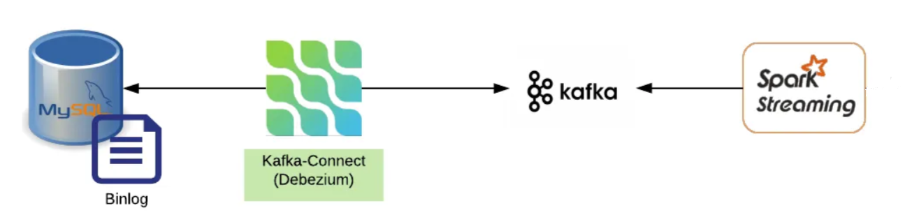

Overview
========

本项目是基于对实时数仓技术的研究学习，探索从RDBMS实时采集同步数据，并借助流式计算框架进行数据处理，完成数据从实时采集、实时计算到实时展示的整个过程。

### <font color=red> 1、技术架构</font>   
+ `MySql`：实时数据源
+ `CDC`：`kafka connect` + `debezium` （实时采集`mysql`变化数据，支持各种`RDBMS`）
+ `Kafka`：分布式消息中间件, 用于缓存`cdc`接收到的实时数据
+ `Spark`：基于`spark structured streaming`流式计算框架，实时处理`kafka`里的数据，最终把结果数据打印到控制台上


### <font color=red> 2、项目部署流程：</font>  

*注：本地需预装 python 和 docker 环境*  

1）clone项目代码到本地, 创建并激活虚拟环境 `venv`, 安装项目依赖
```shell
git clone https://github.com/xy-qimu/spark-kafka-streaming.git 
pip install -r requirements.txt
```
2）启动docker容器服务： <font color=red>docker compose up -d</font>  
3）向kafka connect注册dbz数据源：(注册成功后可访问 http://localhost:8812/ 查看注册信息)
```shell
curl -i -X POST -H "Accept:application/json" -H "Content-Type:application/json" http://localhost:8083/connectors/ -d @./res/connector-mysql.json
```
4）进入Spark容器提交应用：   
```shell
docker exec -it spark-master /bin/bash  
mv /opt/bitnami/spark/conf/log4j2.properties.template /opt/bitnami/spark/conf/log4j2.properties
sed -i "s/rootLogger.level = info/rootLogger.level = warn/" /opt/bitnami/spark/conf/log4j2.properties

cd /opt/share  
spark-submit --packages org.apache.spark:spark-sql-kafka-0-10_2.12:3.5.0 spark_struct-stream-kafka.py
```
5）等待spark应用启动完毕后, 进入mysql容器, 模拟数据生成并实时观察spark的执行结果
```shell
docker exec -it mysql-master bash -c 'mysql -u root -pdebezium inventory'

INSERT INTO customers VALUES (default,'abc','999','abc@example.com');
INSERT INTO customers VALUES (default,'abc','888','abcd@example.com');
INSERT INTO customers VALUES (default,'abc','666','abcde@example.com');
```

